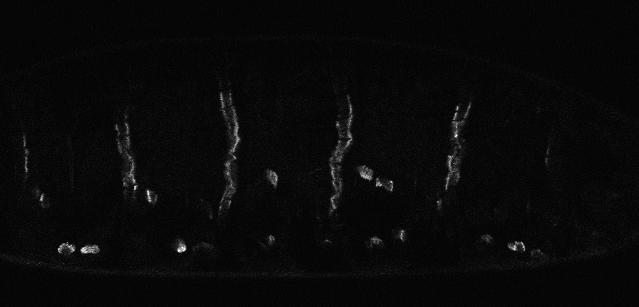
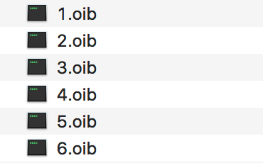

# MAS
Script to analyse intensity and area of muscle attachment sites

## Input data
1. Input files can be any bioformat, but I have tested only on
Olympus Upright .oib files.

1. The files should be stacks of images with embryos aligned along X-axis (with respect to 
anterior-posterior axis). 

1. Files should be labelled by consequent numbers starting with 1 (i.e. 1,2,3,4...) 

**Then simply run MAS_analysis.m, select a folder with images and relax**

## Output data
Two output files will be created directly in the folder with original images:

1. **All.csv** contains information about every individual
attachment site. 
1. **Average.csv** contains avarage values per embryo.

This files include the following information:
1. *Embryo* - the number of the embryo, which corresponds to the number of the image file;
1. *Intensity* - mean intensity of individual attachment sites, or average per embryo. Background intensity (see below) is subtracted from the mean intensity of each attachment site.
1. *Area* - area of individual attachment sites, or average area per embryo.
1. *Total* - a product of intensity and area of individual attachment sites, or average area per embryo.
1. *Eccentricity* - eccentricity of of individual attachment sites, or average area per embryo.
1. *Number MAS* (only in Average.csv) - number of muscle attachment sites identified in each image.

## Algorythm
1. Objects are identified in each z-plane through edge detection, dilation of edges and filling the wholes.
1. The objects are eroded to compensate for previous dilation, and objects in contact with image borders are removed.
1. Background intensity is identified as mean intensity outside of all detected objects.
1. Properties of all objects are determined with regionprops: *Area*, *MeanIntensity*, *Eccentricity*, and *Orientation*.
1. Properties of objects fullfilling the selection criteria are recorded and averaged. The following selection criteria are used:
* object eccentricity is larger than 0.97;
* object area is between 700 and 4000 pixels;
* object orientation is larger than 45° to exclude detection of vitelline membrane;
* mean intensity after subtraction of background intensity is positive.

The second criterium will need to be adjusted depending on the image resolution.

## Reference
For more details and examples see:
Bulgakova N.A., Wellmann J., Brown N.H. (2017) Diverse integrin adhesion stoichiometries caused by varied actomyosin activity. Open Biol., 7(4), [PubMed](https://www.ncbi.nlm.nih.gov/pubmed/28446705). 
